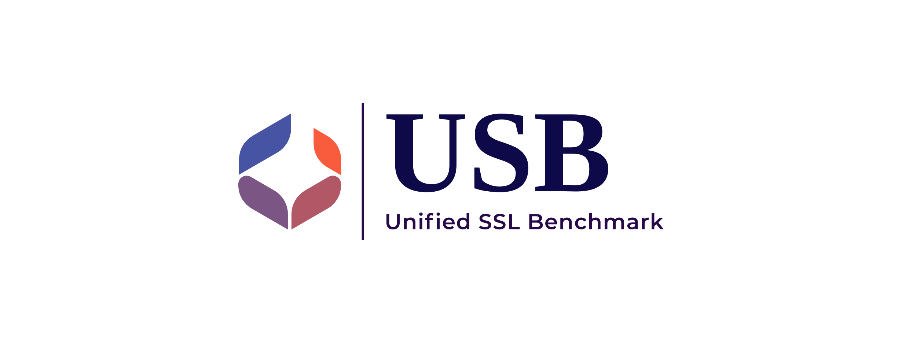

<div id="top"></div>
<!--
*** Thanks for checking out the Best-README-Template. If you have a suggestion
*** that would make this better, please fork the repo and create a pull request
*** or simply open an issue with the tag "enhancement".
*** Don't forget to give the project a star!
*** Thanks again! Now go create something AMAZING! :D
-->

<!-- PROJECT SHIELDS -->

<!--
*** I'm using markdown "reference style" links for readability.
*** Reference links are enclosed in brackets [ ] instead of parentheses ( ).
*** See the bottom of this document for the declaration of the reference variables
*** for contributors-url, forks-url, etc. This is an optional, concise syntax you may use.
*** https://www.markdownguide.org/basic-syntax/#reference-style-links
-->

[![Contributors][contributors-shield]][contributors-url]
[![Forks][forks-shield]][forks-url]
[![Stargazers][stars-shield]][stars-url]
[![Issues][issues-shield]][issues-url]
<!-- 
***[![MIT License][license-shield]][license-url]
-->

<!-- PROJECT LOGO -->

<br />
<div align="center">
  <a href="https://github.com/microsoft/Semi-supervised-learning">
    
  </a>

<!-- <h3 align="center">USB</h3> -->

<p align="center">
    <strong>USB</strong>: A Unified Semi-supervised learning Benchmark for CV, NLP, and Audio Classification
    <!-- <br />
    <a href="https://github.com/microsoft/Semi-supervised-learning"><strong>Explore the docs »</strong></a>
    <br /> -->
    <br />
    <a href="https://arxiv.org/abs/2208.07204">Paper</a>
    ·
    <a href="https://github.com/microsoft/Semi-supervised-learning/tree/main/results">Benchmark</a>
    ·
    <a href="https://colab.research.google.com/drive/1lFygK31jWyTH88ktao6Ow-5nny5-B7v5">Demo</a>
    ·
    <a href="https://usb.readthedocs.io/en/main/">Docs</a>
    ·
    <a href="https://github.com/microsoft/Semi-supervised-learning/issues">Issue</a>
    ·
    <a href="https://www.microsoft.com/en-us/research/lab/microsoft-research-asia/articles/pushing-the-limit-of-semi-supervised-learning-with-the-unified-semi-supervised-learning-benchmark/">Blog</a>
    ·
    <a href="https://zhuanlan.zhihu.com/p/566055279">Blog (Chinese)</a>
    ·
    <a href="https://nips.cc/virtual/2022/poster/55710">Video</a>
    ·
    <a href="https://www.bilibili.com/video/av474982872/">Video (Chinese)</a>
  </p>
</div>

<!-- TABLE OF CONTENTS -->

<details>
  <summary>Table of Contents</summary>
  <ol>
    <li><a href="#news-and-updates">News and Updates</a></li>
    <li><a href="#intro">Introduction</a></li>
    <li>
      <a href="#getting-started">Getting Started</a>
      <ul>
        <li><a href="#prerequisites">Prerequisites</a></li>
        <li><a href="#installation">Installation</a></li>
      </ul>
    </li>
    <li><a href="#usage">Usage</a></li>
    <li><a href="#benchmark-results">Benchmark Results</a></li>
    <li><a href="#model-zoo">Model Zoo</a></li>
    <li><a href="#contributing">Community</a></li>
    <li><a href="#license">License</a></li>
    <li><a href="#acknowledgments">Acknowledgments</a></li>
  </ol>
</details>

<!-- News and Updates -->

## News and Updates
- [01/30/2023] Update semilearn==0.3.0. Add [FreeMatch](https://arxiv.org/abs/2205.07246) and [SoftMatch](https://arxiv.org/abs/2301.10921). Add imbalanced algorithms. Update results and add wandb support. Refer [CHANGE_LOG](CHANGE_LOG.md) for details. [[Results]](https://github.com/microsoft/Semi-supervised-learning/tree/main/results)[[Logs]](https://drive.google.com/drive/folders/1bRSqrRyyuDafgOI3VAuqqiuzHG6CexHF?usp=sharing)[[Wandb]](https://wandb.ai/usb). Older classic logs can be found here: [[TorchSSL Log]](https://1drv.ms/u/s!AlpW9hcyb0KvmyCfsCjGvhDXG5Nb?e=Xc6amH).

- [10/16/2022] Dataset download link and process instructions released! [[Datasets](https://github.com/microsoft/Semi-supervised-learning/tree/main/preprocess)]

- [10/13/2022] We have finished the camera ready version with updated [[Results](https://github.com/microsoft/Semi-supervised-learning/tree/main/results)]. [[Openreview](https://openreview.net/forum?id=QeuwINa96C)]

- [10/06/2022] Training logs and results of USB has been updated! Available dataset will be uploaded soon. [[Logs](https://drive.google.com/drive/folders/1fg3Fxem_UNWhfN5-4x2lRI3mluGxqD4N?usp=sharing)] [[Results](https://github.com/microsoft/Semi-supervised-learning/tree/main/results)]

- [09/17/2022] The USB paper has been accepted by NeurIPS 2022 Dataset and Benchmark Track! [[Openreview](https://openreview.net/forum?id=QeuwINa96C)]

- [08/21/2022] USB has been released!

<!-- Introduction -->

## Introduction

**USB** is a Pytorch-based Python package for Semi-Supervised Learning (SSL). It is easy-to-use/extend, *affordable* to small groups, and comprehensive for developing and evaluating SSL algorithms. USB provides the implementation of 14 SSL algorithms based on Consistency Regularization, and 15 tasks for evaluation from CV, NLP, and Audio domain.


<p align="right">(<a href="#top">back to top</a>)</p>

<!-- GETTING STARTED -->

## Getting Started

This is an example of how to set up USB locally.
To get a local copy up, running follow these simple example steps.

### Prerequisites

USB is built on pytorch, with torchvision, torchaudio, and transformers.

To install the required packages, you can create a conda environment:

```sh
conda create --name usb python=3.8
```

then use pip to install required packages:

```sh
pip install -r requirements.txt
```

From now on, you can start use USB by typing 

```sh
python train.py --c config/usb_cv/fixmatch/fixmatch_cifar100_200_0.yaml
```

### Installation

We provide a Python package *semilearn* of USB for users who want to start training/testing the supported SSL algorithms on their data quickly:

```sh
pip install semilearn
```

<p align="right">(<a href="#top">back to top</a>)</p>

### Development

You can also develop your own SSL algorithm and evaluate it by cloning USB:

```sh
git clone https://github.com/microsoft/Semi-supervised-learning.git
```

<p align="right">(<a href="#top">back to top</a>)</p>


### Prepare Datasets

The detailed instructions for downloading and processing are shown in [Dataset Download](./preprocess/). Please follow it to download datasets before running or developing algorithms.

<p align="right">(<a href="#top">back to top</a>)</p>


<!-- USAGE EXAMPLES -->

## Usage

USB is easy to use and extend. Going through the bellowing examples will help you familiar with USB for quick use, evaluate an existing SSL algorithm on your own dataset, or developing new SSL algorithms.

### Quick Start with USB package

<!-- TODO: add quick start example and refer lighting notebook -->

Please see [Installation](#installation) to install USB first. We provide colab tutorials for:

- [Beginning example](https://colab.research.google.com/drive/1lFygK31jWyTH88ktao6Ow-5nny5-B7v5)
- [Customize datasets](https://colab.research.google.com/drive/1zbswPm1sM8j0fndUQOeqX2HADdYq-wOw)

### Start with Docker

**Step1: Check your environment**

You need to properly install Docker and nvidia driver first. To use GPU in a docker container
You also need to install nvidia-docker2 ([Installation Guide](https://docs.nvidia.com/datacenter/cloud-native/container-toolkit/install-guide.html#docker)).
Then, Please check your CUDA version via `nvidia-smi`

**Step2: Clone the project**

```shell
git clone https://github.com/microsoft/Semi-supervised-learning.git
```

**Step3: Build the Docker image**

Before building the image, you may modify the [Dockerfile](Dockerfile) according to your CUDA version.
The CUDA version we use is 11.6. You can change the base image tag according to [this site](https://hub.docker.com/r/nvidia/cuda/tags).
You also need to change the `--extra-index-url` according to your CUDA version in order to install the correct version of Pytorch.
You can check the url through [Pytorch website](https://pytorch.org).

Use this command to build the image

```shell
cd Semi-supervised-learning && docker build -t semilearn .
```

Job done. You can use the image you just built for your own project. Don't forget to use the argument `--gpu` when you want
to use GPU in a container.

### Training

Here is an example to train FixMatch on CIFAR-100 with 200 labels. Training other supported algorithms (on other datasets with different label settings) can be specified by a config file:

```sh
python train.py --c config/usb_cv/fixmatch/fixmatch_cifar100_200_0.yaml
```

### Evaluation

After training, you can check the evaluation performance on training logs, or running evaluation script:

```
python eval.py --dataset cifar100 --num_classes 100 --load_path /PATH/TO/CHECKPOINT
```

### Develop

Check the developing documentation for creating your own SSL algorithm!

_For more examples, please refer to the [Documentation](https://example.com)_

<p align="right">(<a href="#top">back to top</a>)</p>

<!-- BENCHMARK RESULTS -->

## Benchmark Results

Please refer to [Results](./results) for benchmark results on different tasks.

<p align="right">(<a href="#top">back to top</a>)</p>

<!-- MODEL ZOO -->

## Model Zoo

TODO: add pre-trained models.

<p align="right">(<a href="#top">back to top</a>)</p>

<!-- ROADMAP -->

## TODO

- [ ] Finish Readme
- [ ] Updating SUPPORT.MD with content about this project's support experience
- [ ] Multi-language Support
  - [ ] Chinese

See the [open issues](https://github.com/microsoft/Semi-supervised-learning/issues) for a full list of proposed features (and known issues).

<p align="right">(<a href="#top">back to top</a>)</p>

<!-- CONTRIBUTING -->

## Contributing

This project welcomes contributions and suggestions.  Most contributions require you to agree to a
Contributor License Agreement (CLA) declaring that you have the right to, and actually do, grant us
the rights to use your contribution. For details, visit https://cla.opensource.microsoft.com.

When you submit a pull request, a CLA bot will automatically determine whether you need to provide
a CLA and decorate the PR appropriately (e.g., status check, comment). Simply follow the instructions
provided by the bot. You will only need to do this once across all repos using our CLA.

This project has adopted the [Microsoft Open Source Code of Conduct](https://opensource.microsoft.com/codeofconduct/).
For more information see the [Code of Conduct FAQ](https://opensource.microsoft.com/codeofconduct/faq/) or
contact [opencode@microsoft.com](mailto:opencode@microsoft.com) with any additional questions or comments.

If you have a suggestion that would make USB better, please fork the repo and create a pull request. You can also simply open an issue with the tag "enhancement".
Don't forget to give the project a star! Thanks again!

1. Fork the project
2. Create your branch (`git checkout -b your_name/your_branch`)
3. Commit your changes (`git commit -m 'Add some features'`)
4. Push to the branch (`git push origin your_name/your_branch`)
5. Open a Pull Request

<p align="right">(<a href="#top">back to top</a>)</p>

<!-- TRADEMARKS -->

## Trademarks

This project may contain trademarks or logos for projects, products, or services. Authorized use of Microsoft
trademarks or logos is subject to and must follow
[Microsoft&#39;s Trademark &amp; Brand Guidelines](https://www.microsoft.com/en-us/legal/intellectualproperty/trademarks/usage/general).
Use of Microsoft trademarks or logos in modified versions of this project must not cause confusion or imply Microsoft sponsorship.
Any use of third-party trademarks or logos are subject to those third-party's policies.

<!-- LICENSE -->

## License

Distributed under the MIT License. See `LICENSE.txt` for more information.

<p align="right">(<a href="#top">back to top</a>)</p>

<!-- CONTACT -->

## Community and Contact

The USB comunity is maintained by:

- Yidong Wang (yidongwang37@gmail.com), Tokyo Institute of Technology
- Hao Chen (haoc3@andrew.cmu.edu), Carnegie Mellon University
- Yue Fan (yfan@mpi-inf.mpg.de), Max Planck Institute for Informatics
- Wenxin Hou (wenxinhou@microsoft.com), Microsoft STCA
- Ran Tao (rant@andrew.cmu.edu), Carnegie Mellon University
- Jindong Wang (jindwang@microsoft.com), Microsoft Research Asia

<p align="right">(<a href="#top">back to top</a>)</p>

<!-- CITE -->

## Citing USB

Please cite us if you fine this project helpful for your project/paper:

```
@inproceedings{usb2022,
  doi = {10.48550/ARXIV.2208.07204},
  url = {https://arxiv.org/abs/2208.07204},
  author = {Wang, Yidong and Chen, Hao and Fan, Yue and Sun, Wang and Tao, Ran and Hou, Wenxin and Wang, Renjie and Yang, Linyi and Zhou, Zhi and Guo, Lan-Zhe and Qi, Heli and Wu, Zhen and Li, Yu-Feng and Nakamura, Satoshi and Ye, Wei and Savvides, Marios and Raj, Bhiksha and Shinozaki, Takahiro and Schiele, Bernt and Wang, Jindong and Xie, Xing and Zhang, Yue},
  title = {USB: A Unified Semi-supervised Learning Benchmark for Classification},
  booktitle = {Thirty-sixth Conference on Neural Information Processing Systems Datasets and Benchmarks Track}
  year = {2022}
}

@article{wang2023freematch,
  title={FreeMatch: Self-adaptive Thresholding for Semi-supervised Learning},
  author={Wang, Yidong and Chen, Hao and Heng, Qiang and Hou, Wenxin and Fan, Yue and and Wu, Zhen and Wang, Jindong and Savvides, Marios and Shinozaki, Takahiro and Raj, Bhiksha and Schiele, Bernt and Xie, Xing},
  booktitle={International Conference on Learning Representations (ICLR)},
  year={2023}
}

@article{chen2023softmatch,
  title={SoftMatch: Addressing the Quantity-Quality Trade-off in Semi-supervised Learning},
  author={Chen, Hao and Tao, Ran and Fan, Yue and Wang, Yidong and Wang, Jindong and Schiele, Bernt and Xie, Xing and Raj, Bhiksha and Savvides, Marios},
  booktitle={International Conference on Learning Representations (ICLR)},
  year={2023}
}

@article{zhang2021flexmatch,
  title={FlexMatch: Boosting Semi-supervised Learning with Curriculum Pseudo Labeling},
  author={Zhang, Bowen and Wang, Yidong and Hou, Wenxin and Wu, Hao and Wang, Jindong and Okumura, Manabu and Shinozaki, Takahiro},
  booktitle={Neural Information Processing Systems (NeurIPS)},
  year={2021}
}
```

<!-- ACKNOWLEDGMENTS -->

## Acknowledgments

We thanks the following projects for reference of creating USB:

- [TorchSSL](https://github.com/TorchSSL/TorchSSL)
- [FixMatch](https://github.com/google-research/fixmatch)
- [CoMatch](https://github.com/salesforce/CoMatch)
- [SimMatch](https://github.com/KyleZheng1997/simmatch)
- [HuggingFace](https://huggingface.co/docs/transformers/index)
- [Pytorch Lighting](https://github.com/Lightning-AI/lightning)
- [README Template](https://github.com/othneildrew/Best-README-Template)

<p align="right">(<a href="#top">back to top</a>)</p>

<!-- MARKDOWN LINKS & IMAGES -->

<!-- https://www.markdownguide.org/basic-syntax/#reference-style-links -->

[contributors-shield]: https://img.shields.io/github/contributors/microsoft/Semi-supervised-learning.svg?style=for-the-badge
[contributors-url]: https://github.com/microsoft/Semi-supervised-learning/graphs/contributors
[forks-shield]: https://img.shields.io/github/forks/microsoft/Semi-supervised-learning.svg?style=for-the-badge
[forks-url]: https://github.com/microsoft/Semi-supervised-learning/network/members
[stars-shield]: https://img.shields.io/github/stars/microsoft/Semi-supervised-learning.svg?style=for-the-badge
[stars-url]: https://github.com/microsoft/Semi-supervised-learning/stargazers
[issues-shield]: https://img.shields.io/github/issues/microsoft/Semi-supervised-learning.svg?style=for-the-badge
[issues-url]: https://github.com/microsoft/Semi-supervised-learning/issues
[license-shield]: https://img.shields.io/github/license/microsoft/Semi-supervised-learning.svg?style=for-the-badge
[license-url]: https://github.com/microsoft/Semi-supervised-learning/blob/main/LICENSE.txt
